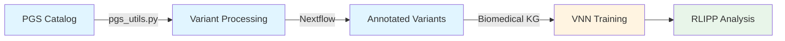

# Blood Cell Trait Variant Processing & VNN Training

Interpretable genomic prediction pipeline for blood cell traits using Visible Neural Networks (VNN).

## Workflow Overview



**Pipeline Stages:**
1. **Data Preprocessing** (A→B→C): Extract variants from PGS models → Subset genotypes → Annotate with snpEff → Map to genes
2. **ML Training** (D): Construct VNN with ontologies derived from biomedical knowledge graph → Train model on genotype-phenotype data
3. **Evaluation** (E): Calculate RLIPP scores → Identify important biological subsystems

---

## Quick Start

### Prerequisites
- Python 3.7+, PyTorch, NetworkX
- Nextflow, Apptainer
- snpEff, bcftools, plink2
- Biomedical knowledge graph ontologies

### Step 1: Data Preprocessing

```bash
# Process PGS models to identify union variants
module load python/3.12
source .venv/bin/activate
python src/pgs_utils.py

# Run Nextflow pipeline for variant annotation
sbatch src/runNF.sh
```

### Step 2: ML Training

```bash
# Train VNN model
python model/run_vnn.py \
    -onto data/ontology.txt \
    -gene2id data/gene2ind.txt \
    -train data/train.pt \
    -test data/test.pt \
    -modeldir MODEL/ \
    -epoch 100
```

### Step 3: Evaluation

```bash
# Calculate RLIPP scores
./model/run_rlipp.sh

# Visualize results
python model/visualize_rlipp.py -input rlipp_scores.tsv -output rlipp_viz
```

---

## Detailed Usage

### 1. Data Preprocessing

#### PGS Processing
Identify union variants for blood cell traits from PGS Catalog.

**Configuration:**
- Trait IDs: `sheets/traits.csv`
- Output directory: specified in `pgs_utils.py`

```bash
python src/pgs_utils.py
```

#### Nextflow Pipeline
Process imputed genotypes through variant subsetting and annotation.

**Configuration:** `config/nfparams.yaml`
- `pgs_ids`: PGS model IDs
- `dir`: Path to binary plink files
- `outdir`: Output directory
- `reference`: snpEff reference genome

**Process steps:**
1. Extract target variants from PGS score files
2. Convert bgen to vcf with plink2
3. Sort and compress vcf files (per chromosome)
4. Merge chromosome vcfs with bcftools
5. Annotate with snpEff
6. Convert to binary format
7. Generate variant-gene mapping csv

```bash
sbatch src/runNF.sh
```

### 2. ML Training

Train Visible Neural Network with ontologies derived from biomedical knowledge graph.

**Key parameters:**

| Parameter | Description | Default |
|-----------|-------------|---------|
| `-onto` | Ontology file from biomedical KG | required |
| `-gene2id` | Gene-to-ID mapping | required |
| `-train` | Training data (.pt) | required |
| `-test` | Test data (.pt) | None |
| `-epoch` | Number of epochs | 50 |
| `-lr` | Learning rate | 0.0002 |
| `-batchsize` | Batch size | 64 |
| `-genotype_hiddens` | Hidden neurons per term | 50 |
| `-alpha` | Auxiliary loss weight | 0.1 |

**Example:**

```bash
python model/run_vnn.py \
    -onto data/ontology.txt \
    -gene2id data/gene2ind.txt \
    -train data/train_data.pt \
    -test data/test_data.pt \
    -modeldir MODEL/ \
    -genotype_hiddens 100 \
    -lr 0.0001 \
    -alpha 0.2 \
    -epoch 100 \
    -batchsize 128
```

**Monitor training:**
```bash
# Console: real-time metrics
# Log file:
tail -f MODEL/logs/*_training.log
```

**Output structure:**
```
MODEL/
├── logs/
│   ├── *_training.log
│   └── *_config.json
├── *_metrics_output.tsv
└── *_model.pt
```

### 3. Evaluation

Calculate RLIPP scores to identify important biological subsystems.

```bash
# Configure model path in run_rlipp.sh
vim model/run_rlipp.sh

# Run RLIPP calculation
./model/run_rlipp.sh

# Visualize
python model/visualize_rlipp.py -input rlipp_scores.tsv -output rlipp_viz
```

See [RLIPP_README.md](RLIPP_README.md) for details.

---

## Troubleshooting

**CUDA out of memory**
- Reduce `-batchsize` or `-genotype_hiddens`

**Ontology has multiple roots**
- Ensure ontology file has single root term

**No improvement in validation**
- Lower learning rate (`-lr`)
- Adjust alpha (`-alpha`)
- Check data quality

**Training is slow**
- Increase `-batchsize` (if memory allows)
- Use GPU
- Reduce `-genotype_hiddens`

**Help Resources:**
- Function annotations in source files
- [ANNOTATION_LOGGING_SUMMARY.md](ANNOTATION_LOGGING_SUMMARY.md)
- Log files for debug information
- [RLIPP_README.md](RLIPP_README.md)

---

## Technical Notes

**snpEff configuration:**
`/nas/{CLUSTERNAME}/rhel8/apps/snpeff/5.2c/snpEff/snpEff.config`

**Nextflow configuration:**
`config/nextflow.config` (process configs)
- Apptainer cache: `.cache/` (default)

**Model architecture:**
Network topology is defined by variant subset, not predefined subgraphs. Ontologies derived from biomedical knowledge graph are used to construct the VNN structure based on genes containing variants.

**Pipeline flow:**
PGS models → variant subset → genotype extraction → annotation → effect filtering → gene mapping → biomedical KG ontologies → VNN structure

**Summary statistics:**
- https://pmc.ncbi.nlm.nih.gov/articles/PMC7482360/
- https://ftp.sanger.ac.uk/pub/project/humgen/summary_statistics/UKBB_blood_cell_traits/

---

## TODO

- Add instructions for `nn_id_from_snpeff.py`

---

## Citation

If using this code, please cite:

> Ma et al. (2018). "Using deep learning to model the hierarchical structure and function of a cell."
> Nature Methods, 15(4), 290-298. PMID: 29505029